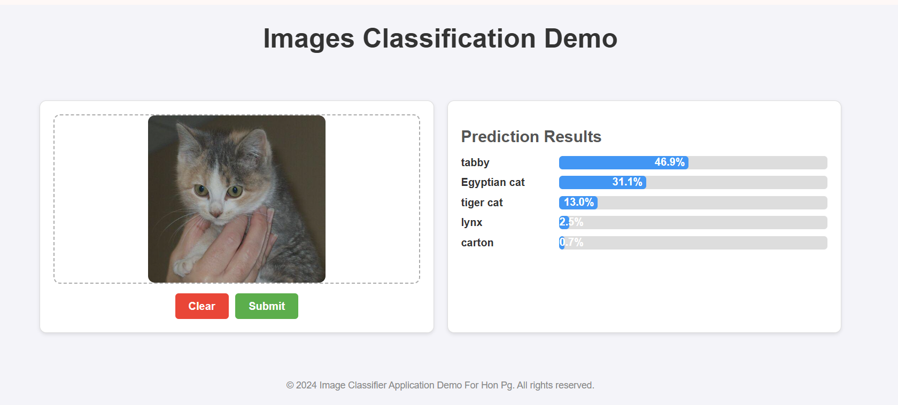

# Image Classification Demo - Triton Inference Server



## Overview

Welcome to the **Code_Demo_Triton** repository! This project demonstrates how to deploy a **FastAPI** application integrated with **NVIDIA Triton Inference Server** for scalable and efficient AI/ML model serving, all within a Dockerized environment.

---

## Features

- **FastAPI for API Development**: A high-performance Python web framework ideal for building RESTful APIs.
- **NVIDIA Triton Integration** : Enable seamless serving of AI/ML models for inference tasks.
- **Dockerized Deployment**: Simplifies the deployment process by containerizing both FastAPI and Triton.
- **Scalability and Modularity** : Flexible architecture using Docker Compose for multi-container orchestration.
---
## Repository Structure

```bash
Code_Demo_Triton/
├── app/
│   ├── main.py          # FastAPI application entry point
│   ├── requirements.txt # Python dependencies
│   └── ...
├── models/              # Pre-trained models for Triton
│   └── example_model/   # Sample model directory for Triton
├── Dockerfile           # Docker build instructions for FastAPI
├── docker-compose.yml   # Multi-container orchestration
└── README.md            # Project documentation

```
---

## Prerequisites
Before starting, ensure you have the following installed:

- **Docker** (v20.x or newer)
- **Docker Compose** (v1.29+)
- **NVIDIA GPU Driver** (optional, for GPU-accelerated inference with Triton)
- **NVIDIA Container** Toolkit (for GPU support in Docker)

---

## Quick Start Guide

### Step 1: Clone the Repository
```bash
git clone https://github.com/Honpg/Code_Demo_Triton.git
cd Code_Demo_Triton
```

### Step 2: Prepare the Environment
**1.** Place your pre-trained models in the models/ directory. Ensure the directory follows Triton's model repository structure.
**2.** Modify main.py in the app/ directory to interact with Triton's gRPC or HTTP endpoint for inference.

### Step 3: Build and Deploy with Docker Compose
Use Docker Compose to deploy both FastAPI and Triton as separate containers:
```bash
docker-compose up -d
```

---

## Access the Application
### **FastAPI**
- **API Base URL**: http://localhost:7000

### **Triton Inference Server**
- **HTTP Endpoint**: http://localhost:8001/v2/models/<model_name>/infer
- **Metrics Endpoint**:: http://localhost:8003/metrics

---

## Contributing
Contributions are welcome! Fork the repository, make improvements, and submit a pull request. For major changes, open an issue to discuss your ideas first.

---
## License
This project is licensed under the MIT License. See the LICENSE file for more details.

---
## Contact
For questions, suggestions, or support, feel free to reach out through GitHub Issues.

🚀 Happy Deploying!

---
